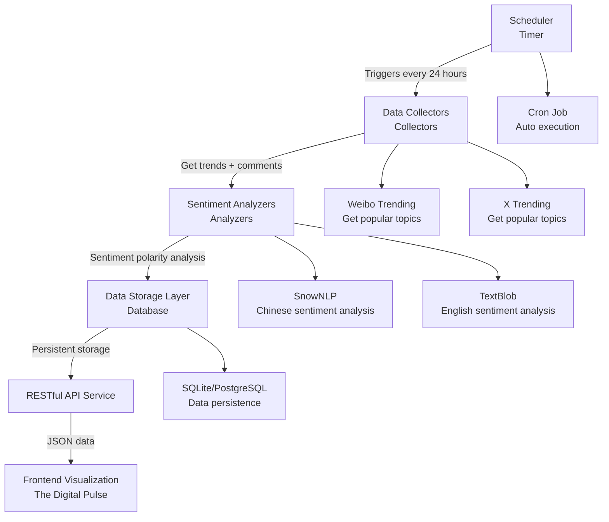
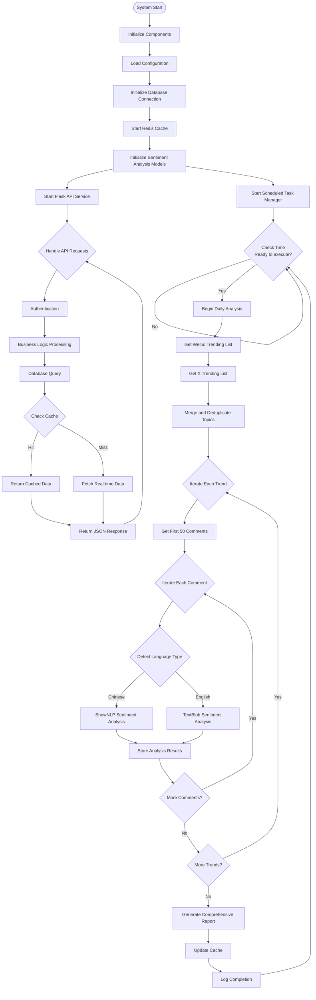
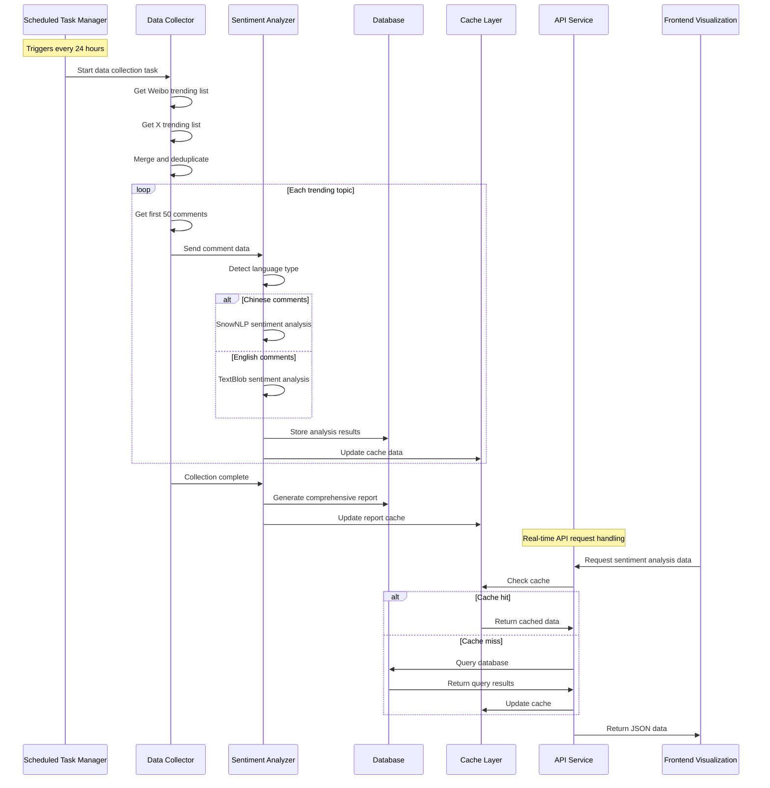

English | [简体中文](README_CN.md)

# TDP-SentimentBridge

The core data ingestion and analysis engine for **The Digital Pulse**, responsible for executing the complete pipeline from data sources to insights. Through integrated API calls and web scraping technology, it aggregates real-time hot topics and related comments from multi-source heterogeneous platforms like X and Weibo. The built-in NLP engine performs sentiment polarity classification on unstructured text data, transforming raw online discourse into structured, quantifiable sentiment indicators to support upper-layer visualization.

## Core Features

- **Multi-platform Data Collection**: Support for mainstream social media platforms including Weibo and X
- **Real-time Trend Tracking**: Fetch real-time trending lists and popular topic trends every 24 hours, analyzing the first 50 comments for each trending topic to reflect comprehensive social sentiment
- **Intelligent Sentiment Analysis**: Chinese sentiment polarity analysis based on SnowNLP, English sentiment polarity analysis based on TextBlob
- **RESTful API**: Standardized API interfaces for easy integration and use

### System Features

#### Automated Scheduling Mechanism
- **Scheduled Execution**: Automatically triggers complete data collection and analysis processes every 24 hours
- **Fault Tolerance**: Automatic retry on collection failures, with up to 3 retry attempts before falling back to cached data
- **Incremental Processing**: Only processes newly added trending topics to avoid duplicate analysis

#### Intelligent Sentiment Analysis
- **Language Detection**: Automatically identifies comment language types (Chinese/English)
- **Bilingual Analysis**: Uses SnowNLP for Chinese, TextBlob for English
- **Batch Processing**: Supports simultaneous processing of comment data from multiple popular topics

#### High-Performance Caching Strategy
- **Multi-layer Caching**: Redis cache + database persistence
- **Intelligent Expiration**: Different expiration times for different data types
  - Trending data: 30 minutes
  - Comment data: 1 hour
  - Sentiment analysis results: 24 hours
  - API responses: 5 minutes

#### Reliability Assurance
- **Error Recovery**: Comprehensive exception handling and automatic recovery mechanisms
- **Monitoring Alerts**: Real-time system status monitoring with automatic alerts for anomalies
- **Service Degradation**: Automatic switching to backup solutions when critical components fail

## Operational Workflow

### System Workflow Diagram



### Detailed Execution Flow



### Data Processing Flow



## Quick Start

### Requirements

- Python 3.13+
- pip package manager

### Install Dependencies

```bash
pip install -r requirements.txt
```

### Basic Configuration

1. Copy the configuration file template:
```bash
cp config/config.example.json config/config.json
```

2. Configure platform authentication (see Configuration section for details)

### Run Service

```bash
python main.py
```

The service will start at `http://localhost:8000`

## API Documentation

### Basic Information

- **Base URL**: `http://localhost:8000/api/v1`
- **Authentication**: Bearer Token (API Key)
- **Data Format**: JSON
- **Character Encoding**: UTF-8

### Core Endpoints

#### 1. Get Weibo Trending List
```bash
GET /api/v1/trends/weibo
```

#### 2. Get X Trending List
```bash
GET /api/v1/trends/x
```

#### 3. Get Public Opinion Sentiment Analysis
```bash
POST /api/v1/sentiment/analyze
```

## Project Architecture

```
TDP-SentimentBridge/
├── README.md                    # Project documentation
├── requirements.txt             # Python dependencies list
├── main.py                     # Main program entry point
├── config/                     # Configuration directory
│   ├── config.example.json     # Configuration file template
│   └── config.json            # Actual configuration file (create manually)
├── src/                        # Source code directory
│   ├── __init__.py
│   ├── api/                   # API interface module
│   │   ├── __init__.py
│   │   ├── app.py            # Flask application and routes
│   │   ├── auth.py           # Authentication functionality
│   │   └── middleware.py     # Middleware
│   ├── collectors/           # Data collection module
│   │   ├── __init__.py
│   │   ├── base.py          # Collector base class
│   │   ├── weibo.py         # Weibo data collector
│   │   └── twitter.py       # Twitter data collector
│   ├── analyzers/           # Analysis module
│   │   ├── __init__.py
│   │   ├── sentiment.py     # Sentiment analyzer
│   │   └── statistics.py    # Statistical analyzer
│   ├── models/              # Data models
│   │   ├── __init__.py
│   │   ├── trend.py        # Trending topic model
│   │   └── comment.py      # Comment data model
│   ├── database/            # Data persistence layer
│   │   ├── __init__.py
│   │   ├── connection.py    # Database connection management
│   │   ├── models.py        # ORM model definitions
│   │   └── migrations/      # Database migration scripts
│   ├── scheduler/           # Task scheduling module
│   │   ├── __init__.py
│   │   ├── tasks.py         # Scheduled task definitions
│   │   └── cron.py          # Cron scheduler
│   ├── cache/              # Cache layer
│   │   ├── __init__.py
│   │   └── redis_client.py  # Redis cache client
│   └── utils/              # Utility module
│       ├── __init__.py
│       ├── http.py         # HTTP request utilities
│       ├── text.py         # Text processing utilities
│       └── logger.py       # Logging utilities
├── logs/                    # Log directory
├── data/                    # Data storage directory
└── docs/                   # Documentation directory
    ├── API_Documentation.md # Detailed API documentation
    └── Configuration.md     # Configuration documentation
```

## Configuration

### Main Configuration Options

```json
{
  "server": {
    "host": "localhost",
    "port": 8000,
    "debug": false
  },
  "platforms": {
    "weibo": {
      "enabled": true,
      "cookie": "your_weibo_cookie",
      "user_agent": "Mozilla/5.0..."
    },
    "x": {
      "enabled": false,
      "api_key": "your_x_api_key",
      "api_secret": "your_x_api_secret"
    }
  },
  "sentiment": {
    "threshold_positive": 0.65,
    "threshold_negative": 0.35
  },
  "limits": {
    "requests_per_minute": 1000,
    "max_comments_per_request": 1000,
    "max_batch_size": 500
  }
}
```

### Environment Variables

- `TDP_ENV`: Runtime environment (development/production)
- `TDP_LOG_LEVEL`: Log level (DEBUG/INFO/WARNING/ERROR)
- `TDP_DB_PATH`: Database file path (optional)


## Contributing

We welcome all forms of contributions! Please follow these steps:

1. Fork this repository
2. Create a feature branch (`git checkout -b feature/AmazingFeature`)
3. Commit your changes (`git commit -m 'Add some AmazingFeature'`)
4. Push to the branch (`git push origin feature/AmazingFeature`)
5. Create a Pull Request

### Development Guidelines

- Follow PEP 8 Python coding standards
- Add appropriate comments and docstrings
- Ensure all tests pass
- Update relevant documentation

## License

This project is licensed under the MIT License - see the [LICENSE](LICENSE) file for details

## Support & Feedback

- Bug reports, technical suggestions: [GitHub Issues](https://github.com/LanceHuang245/TDP-SentimentBridge/issues)
