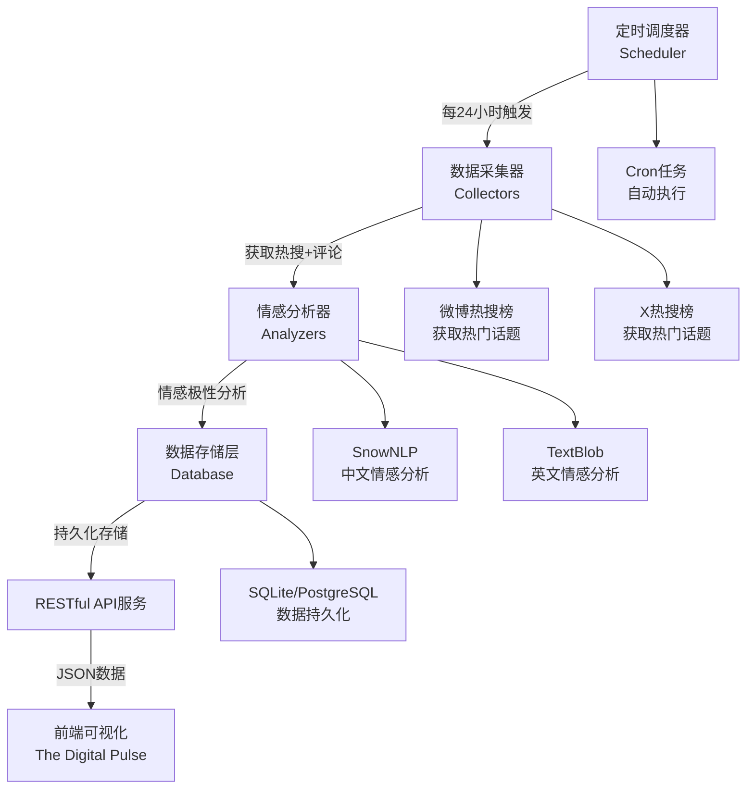
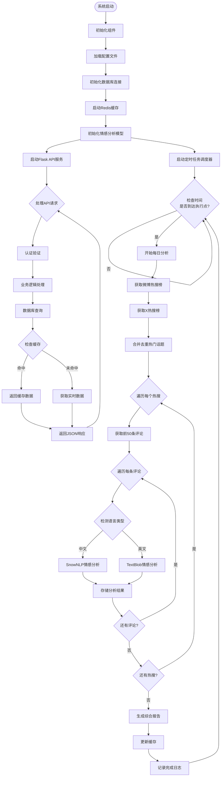
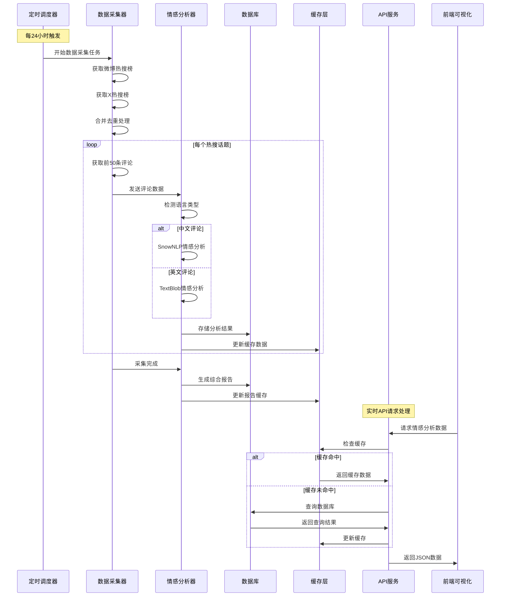

[English](README.md) | 简体中文

# TDP-SentimentBridge

**The Digital Pulse** 的核心数据接入与分析引擎，负责执行从数据源到洞察的完整管道。通过集成化的API调用与网络抓取技术，实时聚合来自X、微博等多源异构平台的热点议题及相关评论，通过模块内置的NLP引擎对非结构化的文本数据进行情感极性分类，将原始网络话语转化为结构化的、可量化的情感指标，为上层可视化提供数据支撑。

## 核心特性

- **多平台数据采集**: 支持微博、X等主流社交媒体平台
- **实时热点追踪**: 每24小时获取实时热搜榜和热门话题趋势，对每条热搜的评论区前50条评论进行情感分析，综合分析结果反应当前社会舆论的综合情绪
- **智能情感分析**: 基于SnowNLP的中文情感极性分析、基于Textblob的英文情感极性分析
- **RESTful API**: 标准化的API接口，易于集成和使用

### 系统特性说明

#### 自动化调度机制
- **定时执行**: 每24小时自动触发完整的数据采集和分析流程
- **容错机制**: 采集失败时自动重试，最多3次重试后使用缓存数据
- **增量处理**: 仅处理新增的热搜话题，避免重复分析

#### 智能情感分析
- **语言检测**: 自动识别评论语言类型（中文/英文）
- **双语分析**: 中文使用SnowNLP，英文使用TextBlob
- **批量处理**: 支持同时处理多个热门话题的评论数据

#### 高性能缓存策略
- **多层缓存**: Redis缓存 + 数据库持久化
- **智能过期**: 不同类型数据设置不同过期时间
  - 热搜数据: 30分钟
  - 评论数据: 1小时
  - 情感分析结果: 24小时
  - API响应: 5分钟

#### 可靠性保障
- **错误恢复**: 完善的异常处理和自动恢复机制
- **监控告警**: 实时监控系统状态，异常情况自动告警
- **服务降级**: 关键组件故障时自动切换到备用方案

## 运行流程

### 系统工作流程图



### 详细执行流程



### 数据处理流程



## 快速开始

### 环境要求

- Python 3.13+
- pip 包管理器

### 安装依赖

```bash
pip install -r requirements.txt
```

### 基础配置

1. 复制配置文件模板：
```bash
cp config/config.example.json config/config.json
```

2. 配置平台认证信息（详见配置说明）

### 运行服务

```bash
python main.py
```

服务将在 `http://localhost:8000` 启动

## API 文档

### 基础信息

- **Base URL**: `http://localhost:8000/api/v1`
- **认证方式**: Bearer Token (API Key)
- **数据格式**: JSON
- **字符编码**: UTF-8

### 核心接口

#### 1. 获取微博热搜榜
```bash
GET /api/v1/trends/weibo
```

#### 2. 获取X热搜榜
```bash
GET /api/v1/trends/x
```

#### 3. 获取舆论情绪分析
```bash
POST /api/v1/sentiment/analyze
```

## 项目架构

```
TDP-SentimentBridge/
├── README.md                    # 项目说明文档
├── requirements.txt             # Python依赖包列表
├── main.py                     # 主程序入口
├── config/                     # 配置文件目录
│   ├── config.example.json     # 配置文件模板
│   └── config.json            # 实际配置文件（需自行创建）
├── src/                        # 源代码目录
│   ├── __init__.py
│   ├── api/                   # API接口模块
│   │   ├── __init__.py
│   │   ├── app.py            # Flask应用和路由
│   │   ├── auth.py           # 认证相关功能
│   │   └── middleware.py     # 中间件
│   ├── collectors/           # 数据采集模块
│   │   ├── __init__.py
│   │   ├── base.py          # 采集器基类
│   │   ├── weibo.py         # 微博数据采集器
│   │   └── twitter.py       # Twitter数据采集器
│   ├── analyzers/           # 分析模块
│   │   ├── __init__.py
│   │   ├── sentiment.py     # 情感分析器
│   │   └── statistics.py    # 统计分析器
│   ├── models/              # 数据模型
│   │   ├── __init__.py
│   │   ├── trend.py        # 热点话题模型
│   │   └── comment.py      # 评论数据模型
│   ├── database/            # 数据持久化层 
│   │   ├── __init__.py
│   │   ├── connection.py    # 数据库连接管理
│   │   ├── models.py        # ORM模型定义
│   │   └── migrations/      # 数据库迁移脚本
│   ├── scheduler/           # 任务调度模块 
│   │   ├── __init__.py
│   │   ├── tasks.py         # 定时任务定义
│   │   └── cron.py          # Cron调度器
│   ├── cache/              # 缓存层 
│   │   ├── __init__.py
│   │   └── redis_client.py  # Redis缓存客户端
│   └── utils/              # 工具模块
│       ├── __init__.py
│       ├── http.py         # HTTP请求工具
│       ├── text.py         # 文本处理工具
│       └── logger.py       # 日志工具 
├── logs/                    # 日志目录 
├── data/                    # 数据存储目录 
└── docs/                   # 文档目录
    ├── API_Documentation.md # 详细API文档
    └── Configuration.md     # 配置说明文档
```

## 配置说明

### 主要配置项

```json
{
  "server": {
    "host": "localhost",
    "port": 8000,
    "debug": false
  },
  "platforms": {
    "weibo": {
      "enabled": true,
      "cookie": "your_weibo_cookie",
      "user_agent": "Mozilla/5.0..."
    },
    "x": {
      "enabled": false,
      "api_key": "your_x_api_key",
      "api_secret": "your_x_api_secret"
    }
  },
  "sentiment": {
    "threshold_positive": 0.65,
    "threshold_negative": 0.35
  },
  "limits": {
    "requests_per_minute": 1000,
    "max_comments_per_request": 1000,
    "max_batch_size": 500
  }
}
```

### 环境变量

- `TDP_ENV`: 运行环境 (development/production)
- `TDP_LOG_LEVEL`: 日志级别 (DEBUG/INFO/WARNING/ERROR)
- `TDP_DB_PATH`: 数据库文件路径（可选）


## 贡献指南

我们欢迎所有形式的贡献！请遵循以下步骤：

1. Fork 本仓库
2. 创建特性分支 (`git checkout -b feature/AmazingFeature`)
3. 提交更改 (`git commit -m 'Add some AmazingFeature'`)
4. 推送到分支 (`git push origin feature/AmazingFeature`)
5. 创建 Pull Request

### 开发规范

- 遵循 PEP 8 Python 代码规范
- 添加适当的注释和文档字符串
- 确保所有测试通过
- 更新相关文档

## 许可证

本项目采用 MIT 许可证 - 详见 [LICENSE](LICENSE) 文件

## 支持与反馈

- 问题报告、技术建议: [GitHub Issues](https://github.com/LanceHuang245/TDP-SentimentBridge/issues)
